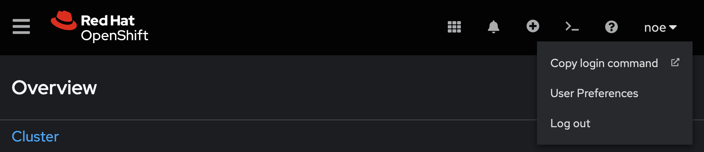

<!--- cSpell:ignore templatized ICPA openshiftconsole Theia userid toolset crwexposeservice gradlew bluemix ocinstall Mico crwopenlink crwopenapp swaggerui gitpat gituser  buildconfig yourproject wireframe devenvsetup viewapp crwopenlink  atemplatized rtifactoryurlsetup Kata Koda configmap Katacoda checksetup cndp katacoda checksetup Linespace igccli regcred REPLACEME Tavis pipelinerun openshiftcluster invokecloudshell cloudnative sampleapp bwoolf hotspots multicloud pipelinerun Sricharan taskrun Vadapalli Rossel REPLACEME cloudnativesampleapp artifactoryuntar untar Hotspot devtoolsservices Piyum Zonooz Farr Kamal Arora Laszewski  Roadmap roadmap Istio Packt buildpacks automatable ksonnet jsonnet targetport podsiks SIGTERM SIGKILL minikube apiserver multitenant kubelet multizone Burstable checksetup handson  stockbffnode codepatterns devenvsetup newwindow preconfigured cloudantcredentials apikey Indexyaml classname  errorcondition tektonpipeline gradlew gitsecret viewapp cloudantgitpodscreen crwopenlink cdply crwopenapp desktoplaptop -->

# Develop and deploy the BFF component of the inventory application

The Inventory BFF's role in the architecture is to act as an orchestrator between the core business services and the specific digital channel it is focused on supporting. This class article will give you more detail about the [Backend For Frontend architectural pattern](https://samnewman.io/patterns/architectural/bff/) and the benefits.

|                                                             |
| :--------------------------------------------------------------------------------------------------: |
| *Backend For Frontend pattern Overview - [source](https://samnewman.io/patterns/architectural/bff/)* |

The Inventory solution will use [GraphQL](https://graphql.org/) for its BFF layer, which enables the API to be dynamically controlled from the client using API queries. Follow the steps below to get started.

## Setup

!!! note
     Following this section means you have already deployed and configured the backend service from the previous step. Your OpenShift cluster should have the `inventory-${INITIALS}-dev` project (with `${INITIALS}` as your actual initials), that has been configured with `ci-config` and `registry-config` secrets during previous lab.

### Create your OpenShift project, Git Repository and CI pipeline

- Create a new repository from the [Typescript GraphQL template](https://github.com/cloud-design-patterns-journey/template-graphql-typescript/generate).

    !!! warning
        In order to prevent naming collisions if you are running this as part of a workshop, chose the GitHub organization you have been invited to as `Owner` and name the repository `inv-bff-${INITIALS}`, replacing `${INITIALS}` with your actual initials.

- Deploy this application with Tekton:

    !!! note
        You should have the [`tkn`](https://github.com/tektoncd/cli?tab=readme-ov-file#installing-tkn), [`tkn pac`](https://pipelinesascode.com/docs/guide/cli/#install) and `oc` CLIs installed. `oc` can be installed through the help section of your OpenShift console.
    
    - In the OpenShift web console, click on the user ID on the top right, click on **Copy login command** and get the OpenShift login command, which includes a token.
    
      
    
    - Click on **Display Token**, copy the Login with the token. oc login command will log you in. Run the login command in your terminal:
    
      ```sh
      oc login --token=<OCP_TOKEN> --server=<OCP_SERVER>
      ```
    
    - Move to your `inventory-${INITIALS}-dev` project created in previous lab:
    
      ```sh
      export INITIALS=ns # CHANGEME
      oc project inventory-${INITIALS}-dev
      ```

    - Clone the repo locally:

      ```sh
      git clone https://github.com/cloud-design-patterns-journey/inv-bff-${INITIALS}.git
      cd inv-bff-${INITIALS}
      ```

    - Create the tekton pipeline for the backend service your new project:

      ```sh
      oc adm policy add-scc-to-user privileged -z pipeline
      tkn pac create repository
      ```

    !!! note
        - `tkn pac create repository` assumes you have [Pipelines-as-Code](https://pipelinesascode.com/docs/install/overview/) already setup on your cluster and Git provider. If you are running this lab as part of a workshop, this has been configured for you, make sure you use the provided GitHub organization when you create yout Git repository from template above.
        - `oc adm policy add-scc-to-user privileged -z pipeline` will make sure that the Tekton pipeline will be able to escalade privileges in your `inventory-${INITIALS}-dev` project/namespace.

    - In OpenShift console (**Pipelines Section > Pipelines > Repositories**), edit the newly created `Repository` YAML to add cluster specific configuration (e.g. image repository):

      ```yaml
      ...
      spec:
        params:
          - name: img-server
            secret_ref:
              name: ci-config
              key: img-server
          - name: img-namespace
            secret_ref:
              name: ci-config
              key: img-namespace
      ...
      ```

### Choose your development environment

=== "Gitpod"
    - Head over to [gitpod.io](https://gitpod.io), login with your github account by clicking **Continue with GitHub**.
      
    - Grant access to gitpod to your GitHub organization by going to account settings on the top right corner, navigate to **Integrations**, go to GitHub and click **Manage on GitHub**.
      
    - On GitHub, search the organization you have used to create the repository and click **grant** to allow gitpod to access repositories in that organization.
      
    - Back to [gitpod.io](https://gitpod.io/workspaces), navigate to workspaces and click **New Workspace** to create a new workspace, give it your newly created repository URL.

    - If it is your first gitpod workspace, it will ask you for your preferred editor, pick the in browser Visual Studio Code, and the workspace will be created automatically for you.

=== "Locally"
    Clone the project and open it using your favorite text editor or IDE (Visual Studio Code, Atom...).
    
You are now ready to modify the application!

## Create the REST interface

The controller provides the REST interface for our BFF. The template uses the `typescript-rest`
package to simplify the tasks required to create a controller.

Since we will be developing this microservice following the [Test Driven Development](https://en.wikipedia.org/wiki/Test-driven_development) approach, we are first going to create the test for our `stock-items` controller.

- Start the tests by running the following command in a new terminal that you will keep running while running the lab:
    ```bash
    npm run tdd
    ```

- Create the controller test:
    ```typescript title="test/controllers/stock-items.controller.spec.ts"
    import * as request from 'supertest';
    import { Test, TestingModule } from '@nestjs/testing';
    import { INestApplication } from '@nestjs/common';
    import { AppModule } from '../../src/app.module';

    describe('stock-item.controller', () => {

        let app: INestApplication;
        beforeEach(async () => {
            const moduleFixture: TestingModule = await Test.createTestingModule({
            imports: [AppModule],
            }).compile();
        
            app = moduleFixture.createNestApplication();
            await app.init();
        });

        test('canary verifies test infrastructure', () => {
            expect(true).toEqual(true);
        });

        describe('given GET /stock-items', () => {
            describe('when service is successful', () => {
                test('then return 200 status', async () => {
                    return request(app.getHttpServer()).get('/stock-items').expect(200);
                });

                test('then should return an empty array', async () => {
                    return request(app.getHttpServer()).get('/stock-items').expect([]);
                });
            });
        });
    });
    ```

- Notice that tests are failing.

- Create the controller component:
    ```typescript title="src/controllers/stock-items.controller.ts"
    import { Controller, Get } from '@nestjs/common';

    @Controller('stock-items')
    export class StockItemsController {

        @Get()
        async listStockItems(): Promise<any[]> {
            return [];
        }
    }
    ```

- Add the controller to the controllers `index.ts`. (Using `index.ts` is a good way to manage which components are exposed
by a component and provide a good way to load the modules that will be injected into other components):
    ```typescript title="src/controllers/index.ts"
    import { HelloWorldController } from './hello-world';
    import { StockItemsController } from './stock-items.controller';

    export * from './hello-world';
    export * from './stock-items.controller';

    export const controllers = [HelloWorldController, StockItemsController];
    ```

- Start the service to see it running:
    ```bash
    npm start
    ```

- Access the running service. This service runs on port `3000`:

=== "Gitpod"
    - Once you run the application, Gitpod gives the option to make the port **Public**, in the bottom-right corner.Once you make the port Public, it gives you the option to **Open Preview** or **Open Browser**.

=== "Desktop/Laptop" 
    - Open a browser to `http://localhost:3000/api-docs` to see the swagger page

    - Expand our service from the list, click `Try it out`, then click `Execute`

- Push the changes we've made to the repository:
    ```bash
    git add .
    git commit -s -m "Adds stock items controller"
    git push
    ```

- CI pipeline should be kicked off, you can test the hosted application once complete.

## Update the controller to call a service

The pattern recommended for the REST controllers is to let it focus on translating REST protocols
into javascript and to put the business logic in a separate service component.

The pattern recommended for the REST controllers is to let it focus on translating REST protocols
into javascript and to put the business logic in a separate service component.

- Add a StockItem model that contains the values needed for the UI:
    ```typescript title="src/models/stock-item.model.ts"
    import { Field, ObjectType } from "@nestjs/graphql";

    export interface StockItemModel {
        id: string;
        name: string;
        stock: number;
        unitPrice: number;
        manufacturer: string;
        picture: string;
    }

    @ObjectType({ description: 'stock-item' })
    export class StockItem implements StockItemModel {
        @Field()
        id: string;
        @Field()
        name: string;
        @Field()
        stock: number;
        @Field()
        unitPrice: number;
        @Field()
        manufacturer: string;
        @Field()
        picture: string;
    }
    ```

- Register the model with the `index.ts` file in the models directory. Append this to end of the file:
    ```typescript title="src/models/index.ts"
    ...
    export * from './stock-item.model';
    ```

- Define an abstract class to provide the interface for our API:
    ```typescript title="src/services/stock-items/stock-items.api.ts"
    import { StockItemModel } from '../../models';

    export abstract class StockItemsApi {
        abstract listStockItems(): Promise<StockItemModel[]>;
    }
    ```

    !!! note
        **Why an abstract class and not an interface?**
        TypeScript introduces both abstract classes and interfaces. Abstract classes can be used and they have the quirky behavior in TypeScript allowing them to either be `extended` like a class or `implemented` like an interface.

- Lets create an implementation that will provide mock data for now. Add a `stock-items-mock.service` to services:
    ```typescript title="src/services/stock-items/stock-items-mock.service.ts"
    import { Injectable } from '@nestjs/common';
    import { StockItemsApi } from './stock-items.api';
    import { StockItemModel } from '../../models';

    @Injectable()
    export class StockItemsMockService implements StockItemsApi {
    async listStockItems(): Promise<StockItemModel[]> {
            return [
                {
                    id: "1",
                    name: "Self-sealing stem bolt",
                    stock: 10,
                    unitPrice: 10.5,
                    picture: "https://via.placeholder.com/32.png",
                    manufacturer: "Bajor Galactic"
                },
                {
                    id: "2",
                    name: "Heisenberg compensator",
                    stock: 20,
                    unitPrice: 20.0,
                    picture: "https://via.placeholder.com/32.png",
                    manufacturer: "Federation Imports"
                },
                {
                    id: "3",
                    name: "Tooth sharpener",
                    stock: 30,
                    unitPrice: 5.25,
                    picture: "https://via.placeholder.com/32.png",
                    manufacturer: "Farenginar Exploits"
                }
            ];
        }
    }
    ```

- Create a `src/services/stock-items/index.ts` to reference above classes:

    ```typescript title="src/services/stock-items/index.ts"
    import {Provider} from "@nestjs/common";

    import { StockItemsApi } from './stock-items.api';
    import { StockItemsMockService } from './stock-items-mock.service';

    export { StockItemsMockService, StockItemsApi };

    export const provider: Provider = {
        provide: StockItemsApi,
        useClass: StockItemsMockService,
    };
    ```

- Update the `src/services/providers.ts` file to reference the new service:
    ```typescript title="src/services/providers.ts"
    import { Provider } from "@nestjs/common";
    import { provider as helloWorldProvider } from "./hello-world";
    import { StockItemsMockService, StockItemsApi, provider as stockItemsProvider } from "./stock-items";

    export * from './hello-world';

    export const providers: Provider[] = [helloWorldProvider, stockItemsProvider];
    export { StockItemsApi, StockItemsMockService };
    ```

- Update the controller test to inject the service into the controller and to return the value from the service:
    ```typescript title="test/controllers/stock-items.controller.spec.ts"
    import * as request from 'supertest';
    import { Test, TestingModule } from '@nestjs/testing';
    import { INestApplication } from '@nestjs/common';
    import { AppModule } from '../../src/app.module';
    import { StockItemsApi } from '../../src/services';


    const mockResult = [
        {
            id: "1",
            name: "Self-sealing stem bolt",
            stock: 10,
            unitPrice: 10.5,
            picture: "https://via.placeholder.com/32.png",
            manufacturer: "Bajor Galactic"
        },
        {
            id: "2",
            name: "Heisenberg compensator",
            stock: 20,
            unitPrice: 20.0,
            picture: "https://via.placeholder.com/32.png",
            manufacturer: "Federation Imports"
        },
        {
            id: "3",
            name: "Tooth sharpener",
            stock: 30,
            unitPrice: 5.25,
            picture: "https://via.placeholder.com/32.png",
            manufacturer: "Farenginar Exploits"
        }
    ];

    describe('stock-item.controller', () => {

        let app: INestApplication;
        let stockItemsService = { listStockItems: () => mockResult };

        beforeEach(async () => {

            const moduleFixture: TestingModule = await Test.createTestingModule({
                imports: [AppModule],
            })
                .overrideProvider(StockItemsApi)
                .useValue(stockItemsService)
                .compile();

            app = moduleFixture.createNestApplication();
            await app.init();
        });

        test('canary verifies test infrastructure', () => {
            expect(true).toEqual(true);
        });

        describe('given GET /stock-items', () => {
            describe('when service is successful', () => {
                test('then return 200 status', async () => {
                    return request(app.getHttpServer()).get('/stock-items').expect(200);
                });

                test('then should return an empty array', async () => {
                    return request(app.getHttpServer()).get('/stock-items').expect(mockResult);
                });
            });
        });
    });
    ```

- Update the controller to inject the service and use it:
    ```typescript title="src/controllers/stock-items.controller.ts"
    import { Controller, Get, HttpException } from '@nestjs/common';

    import { StockItemsApi } from '../services';

    @Controller('stock-items')
    export class StockItemsController {
        constructor(private readonly service: StockItemsApi) { }

        @Get()
        async listStockItems(): Promise<any[]> {
            try {
                return await this.service.listStockItems();
            } catch (err) {
                throw new HttpException(err, 502);
            }
        }
    }
    ```

- Start the service
    ```bash
    npm start
    ```

- Access the running service. This service runs on port `3000`:

=== "Gitpod"
    - Once you run the application, Gitpod gives the option to make the port **Public**, in the bottom-right corner.Once you make the port Public, it gives you the option to **Open Preview** or **Open Browser**.

=== "Desktop/Laptop" 
    - Open a browser to `http://localhost:3000/api-docs` to see the swagger page

    - Expand our service from the list, click `Try it out`, then click `Execute`

- Push the changes we've made to the repository:
    ```bash
    git add .
    git commit -s -m "Adds a mock service implementation"
    git push
    ```

- CI pipeline should be kicked off, you can test the hosted application once complete.

## Add a GraphQL implementation of Stock Items

The GraphQL template supports both REST and GraphQL APIs for accessing backend services. We have created
a REST controller to expose the results from the service and now we will do the same
for GraphQL.

- Add a `stock-item` GraphQL resolver in the `resolvers` directory:
    ```typescript title="src/resolvers/stock-items/stock-items.resolver.ts"
    import { Query, Resolver } from "@nestjs/graphql";

    import { StockItem, StockItemModel } from "../../models";
    import { StockItemsApi } from "../../services";

    @Resolver(of => StockItem)
    export class StockItemResolver {
        constructor(private readonly service: StockItemsApi) { }

        @Query(returns => [StockItem])
        async stockItems(): Promise<StockItemModel[]> {
            return this.service.listStockItems();
        }
    }
    ```

- Add the stock-items resolver to `index.ts` in the `stock-items` resolver directory:
    ```typescript title="src/resolvers/stock-items/index.ts"
    export * from './stock-items.resolver';
    ```

- Reference the `StockItemResolver` in `src/resolvers/providers.ts`:
    ```typescript title="src/resolvers/providers.ts"
    import {Provider} from "@nestjs/common";
    import {HelloWorldResolver} from "./hello-world";
    import {StockItemResolver} from "./stock-items";

    export * from './hello-world';
    export * from './stock-items';

    export const providers: Provider[] = [HelloWorldResolver, StockItemResolver]
    ```

- Start the service:
    ```bash
    npm start
    ```

- Verify that the that the resolver is available using the Graph QL browser provided by the template:

=== "Gitpod"
    - Once you run the application, Gitpod gives the option to make the port **Public**, in the bottom-right corner.Once you make the port Public, it gives you the option to **Open Preview** or **Open Browser**.

=== "Desktop/Laptop" 
    - In your Browser, open GraphQL playground: `http://localhost:3000/graphql`
    - Run the query `query { stockItems { name } }`

- Push the changes we've made to the repository:
    ```bash
    git add .
    git commit -s -m "Adds a graphql interface"
    git push
    ```

- CI pipeline should be kicked off, you can test the hosted application once complete.

## Create a service implementation that calls the microservice

- Install required `superagent` module:

    ```sh
    npm i superagent
    ```

- Add a `src/services/stock-items/stock-items.service.ts` service implementation that we'll configure to target our actual stock items Java based service:
    ```typescript title="src/services/stock-items/stock-items.service.ts"
    import { Injectable } from '@nestjs/common';
    import { StockItemsApi } from './stock-items.api';
    import { StockItemModel } from '../../models';
    import { get } from 'superagent';
    import { ConfigService } from '@nestjs/config';

    class StockItem {
        'id'?: string;
        'manufacturer'?: string;
        'picture'?: string;
        'name'?: string;
        'price'?: number;
        'stock'?: number;
    }

    @Injectable()
    export class StockItemsService implements StockItemsApi {
        constructor(private configService: ConfigService) { }

        async listStockItems(): Promise<StockItemModel[]> {
            const serviceUrl = this.configService.get<string>('SERVICE_URL');
            return new Promise((resolve, reject) => {
                get(`${serviceUrl}/stock-items`)
                    .set('Accept', 'application/json')
                    .then(res => {
                        resolve(this.mapStockItems(res.body));
                    })
                    .catch(err => {
                        reject(err);
                    });
            });
        }

        mapStockItems(data: StockItem[]): StockItemModel[] {
            return data.map(this.mapStockItem);
        }

        mapStockItem(item: StockItem): StockItemModel {
            return {
                id: item.id,
                name: item.name,
                stock: item.stock,
                unitPrice: item.price,
                picture: item.picture ?? 'https://via.placeholder.com/32.png',
                manufacturer: item.manufacturer,
            };
        }
    }
    ```

    !!! note
        From now on, we'll need a `SERVICE_URL` environment variable to be used as base URL to reach our Java microservice.


- Update `src/services/stock-items/index.ts` to reference and use our newly created service as provider:
    ```typescript title="src/services/stock-items/index.ts"
    import {Provider} from "@nestjs/common";

    import { StockItemsApi } from './stock-items.api';
    import { StockItemsMockService } from './stock-items-mock.service';
    import { StockItemsService } from './stock-items.service';

    export { StockItemsMockService, StockItemsApi, StockItemsService };

    export const provider: Provider = {
        provide: StockItemsApi,
        useClass: StockItemsService,
    };
    ```

- Test the application again by setting `SERVICE_URL` before running the app:
    ```bash
    export SERVICE_URL=http://localhost:8080 # CHANGEME
    npm start
    ```

- Last step before checking out our changes to git is to make sure our Kubernetes/OpenShift deployment will get the `SERVICE_URL` environment variable configured. To do so, create a secret and patch the deployment to use it as source for environment variables:

    ```sh
    oc create secret generic inv-bff-${INITIALS}-config --from-literal=SERVICE_URL=http://inv-svc-${INITIALS}:8080
    kubectl set env --from=secret/inv-bff-${INITIALS}-config deployment/inv-bff-${INITIALS}
    ```

- After validation, commit and push the changes to git:
    ```bash
    git add .
    git commit -s -m "Adds service implementation"
    git push
    ```

- CI pipeline should be kicked off, you can test the hosted application once complete.
