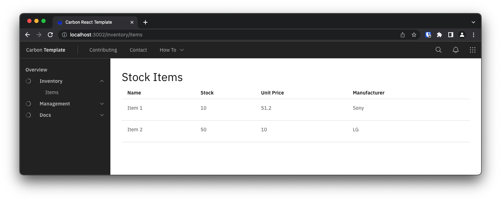

<!--- cSpell:ignore ICPA openshiftconsole Theia userid toolset crwexposeservice gradlew bluemix ocinstall Mico crwopenlink crwopenapp swaggerui gitpat gituser  buildconfig yourproject wireframe devenvsetup viewapp crwopenlink  atemplatized rtifactoryurlsetup Kata Koda configmap Katacoda checksetup cndp katacoda checksetup Linespace igccli regcred REPLACEME Tavis pipelinerun openshiftcluster invokecloudshell cloudnative sampleapp bwoolf hotspots multicloud pipelinerun Sricharan taskrun Vadapalli Rossel REPLACEME cloudnativesampleapp artifactoryuntar untar Hotspot devtoolsservices Piyum Zonooz Farr Kamal Arora Laszewski  Roadmap roadmap Istio Packt buildpacks automatable ksonnet jsonnet targetport podsiks SIGTERM SIGKILL minikube apiserver multitenant kubelet multizone Burstable checksetup handson  stockbffnode codepatterns devenvsetup newwindow preconfigured cloudantcredentials apikey Indexyaml classname  errorcondition tektonpipeline gradlew gitsecret viewapp cloudantgitpodscreen crwopenlink cdply crwopenapp desktoplaptop -->

# Develop and deploy the UI component of the inventory application

## Setup

!!! note
    Following this section means you have already deployed and configured the backend and BFF services from the previous steps. Your OpenShift cluster should have the `inventory-${INITIALS}-dev` project (with `${INITIALS}` as your actual initials), that has been configured with `ci-config` and `registry-config` secrets during previous lab.

### Create your OpenShift project, Git Repository and CI pipeline

- Create a new repository from the [Carbon React template](https://github.com/cloud-design-patterns-journey/template-carbon-react).

    !!! warning
        In order to prevent naming collisions if you are running this as part of a workshop, chose the GitHub organization you have been invited to as `Owner` and name the repository `inv-ui-${INITIALS}`, replacing `${INITIALS}` with your actual initials.

- Deploy this application with Tekton:

    !!! note
        You should have the [`tkn`](https://github.com/tektoncd/cli?tab=readme-ov-file#installing-tkn), [`tkn pac`](https://pipelinesascode.com/docs/guide/cli/#install) and `oc` CLIs installed. `oc` can be installed through the help section of your OpenShift console.
    
    - In the OpenShift web console, click on email address top right, click on **Copy login command** and get the OpenShift login command, which includes a token.
    
      
    
    - Click on **Display Token**, copy the Login with the token. oc login command will log you in. Run the login command in your terminal:
    
      ```sh
      oc login --token=<OCP_TOKEN> --server=<OCP_SERVER>
      ```
    
    - Move to your `inventory-${INITIALS}-dev` project created in previous lab:
    
      ```sh
      export INITIALS=ns # CHANGEME
      oc project inventory-${INITIALS}-dev
      ```

    - Clone the repo locally:

      ```sh
      git clone https://github.com/cloud-design-patterns-journey/inv-ui-${INITIALS}.git
      cd inv-ui-${INITIALS}
      ```

    - Create the tekton pipeline for the backend service your new project:

      ```sh
      oc adm policy add-scc-to-user privileged -z pipeline
      tkn pac create repository
      ```

    !!! note
        - `tkn pac create repository` assumes you have [Pipelines-as-Code](https://pipelinesascode.com/docs/install/overview/) already setup on your cluster and Git provider. If you are running this lab as part of a workshop, this has been configured for you, make sure you use the provided GitHub organization when you create yout Git repository from template above.
        - `oc adm policy add-scc-to-user privileged -z pipeline` will make sure that the Tekton pipeline will be able to escalade privileges in your `inventory-${INITIALS}-dev` project/namespace.

    - In OpenShift console (**Pipelines Section > Pipelines > Repositories**), edit the newly created `Repository` YAML to add cluster specific configuration (e.g. image repository):

      ```yaml
      ...
      spec:
        params:
          - name: img-server
            secret_ref:
              name: ci-config
              key: img-server
          - name: img-namespace
            secret_ref:
              name: ci-config
              key: img-namespace
      ...
      ```

### Choose your development environment

=== "Gitpod"
    - Head over to [gitpod.io](https://gitpod.io), login with your github account by clicking **Continue with GitHub**.
      
    - Grant access to gitpod to your GitHub organization by going to account settings on the top right corner, navigate to **Integrations**, go to GitHub and click **Manage on GitHub**.
      
    - On GitHub, search the organization you have used to create the repository and click **grant** to allow gitpod to access repositories in that organization.
      
    - Back to [gitpod.io](https://gitpod.io/workspaces), navigate to workspaces and click **New Workspace** to create a new workspace, give it your newly created repository URL.

    - If it is your first gitpod workspace, it will ask you for your preferred editor, pick the in browser Visual Studio Code, and the workspace will be created automatically for you.

=== "Locally"
    Clone the project and open it using your favorite text editor or IDE (Visual Studio Code, Atom...).
    
You are now ready to modify the application!

### Create the initial components

Based on the requirements of this first use case, we will create a `StockItemList` component to list stock items.

- Open a terminal and start the application in development mode to see the initial UI and the changes as we make them:

    ```shell
    yarn start:dev
    ```

- Access the running service. This service runs by default on port `3000`.

- Create the `StockItemList` React component that uses a `StructuredList` from the [Carbon React Components](https://react.carbondesignsystem.com) portfolio:
    ```javascript title="src/content/StockItemList.jsx"
    import React from "react";
    import {
        StructuredListWrapper, StructuredListHead, StructuredListRow,
        StructuredListCell, StructuredListBody
    } from '@carbon/react';

    const DEFAULT_ITEMS = [
        {
            name: 'Item 1',
            stock: 10,
            unitPrice: 51.2,
            manufacturer: 'Sony'
        },
        {
            name: 'Item 2',
            stock: 50,
            unitPrice: 10,
            manufacturer: 'LG'
        },
    ]

    export default function StockItemList() {
        const items = DEFAULT_ITEMS;

        return (
            <div className="stock-items-list">
                <h2>Stock Items</h2>
                <StructuredListWrapper>
                    <StructuredListHead>
                        <StructuredListRow head>
                            <StructuredListCell head>Name</StructuredListCell>
                            <StructuredListCell head>Stock</StructuredListCell>
                            <StructuredListCell head>Unit Price</StructuredListCell>
                            <StructuredListCell head>Manufacturer</StructuredListCell>
                        </StructuredListRow>
                    </StructuredListHead>
                    <StructuredListBody>
                        {items.map(item => (
                            <StructuredListRow>
                                <StructuredListCell noWrap>{item.name}</StructuredListCell>
                                <StructuredListCell noWrap>{item.stock}</StructuredListCell>
                                <StructuredListCell noWrap>{item.unitPrice}</StructuredListCell>
                                <StructuredListCell noWrap>{item.manufacturer}</StructuredListCell>
                            </StructuredListRow>
                        ))}
                    </StructuredListBody>
                </StructuredListWrapper>
            </div>
        );
    }
    ```

- Now that we have our component to list stock items, let's add it to out app by editing the `src/content/UIShell/UIShell.jsx` file:
    -  Add our new component to the bottom of the imports section:
      ```javascript title="src/content/UIShell/UIShell.jsx"
      ...
      import StockItemList from "../StockItemList";
      ...
      ```
    -  Add a menu to our left navigation panel to link to a new `/inventory/items` route that we'll use to list stock items:
      ```javascript title="src/content/UIShell/UIShell.jsx"
      ...
      <SideNav aria-label="Side navigation" expanded={isSideNavExpanded}>
          <SideNavItems>
              <SideNavMenuItem element={Link} to='/'
                  isActive={this.state.activeItem === '/'}
                  onClick={() => { this.setState({ activeItem: '/' }) }}>
                  Overview
              </SideNavMenuItem>
              <SideNavMenu renderIcon={Fade} title="Inventory" defaultExpanded>
                  <SideNavMenuItem element={Link} to='/inventory/items'
                      isActive={this.state.activeItem === '/inventory/items'}
                      onClick={() => { this.setState({ activeItem: '/inventory/items' }) }}>
                      Items
                  </SideNavMenuItem>
              </SideNavMenu>
              <SideNavMenu renderIcon={Fade} title="Management">
                  <SideNavMenuItem href="#">
                      Link
                  </SideNavMenuItem>
                  <SideNavMenuItem href="#">
                      Link
                  </SideNavMenuItem>
                  <SideNavMenuItem href="#">
                      Link
                  </SideNavMenuItem>
              </SideNavMenu>
              <SideNavMenu
                  renderIcon={Fade}
                  title="Docs">
                  <SideNavMenuItem href="#">
                      Link
                  </SideNavMenuItem>
                  <SideNavMenuItem href="#">
                      Link
                  </SideNavMenuItem>
              </SideNavMenu>
          </SideNavItems>
      </SideNav>
      ...
      ```
      - Add a new route for the `/inventory/items` route:
      ```javascript title="src/content/UIShell/UIShell.jsx"
      ...
      <Routes>
          <Route path="/" element={<LandingPage />} />
          <Route path="/inventory/items" element={<StockItemList />} />
          <Route path="*" element={<NotFound />} />
      </Routes>
      ...
      ```

- Open the application to check that you can now navigate to the ***Stock Items*** view:
    

- With the application running in the first terminal, open a second terminal in the repository directory and push the changes we've just made:
    ```bash
    git add .
    git commit -m "Initial shell components"
    git push
    ```

- CI pipeline should be kicked off, you can test the hosted application once complete.

### Add a service component to get mock Stock Items

Now that we've created the initial components, we can start to customize the `StockItemList` to match the data for our application. So far, we've built a UI that displays a hard-coded set of data in a table. Eventually, we want to display dynamic data provided from a database in the table. As a first step towards that goal, we need to separate the UI logic from the logic that retrieves the data. We will do that with a service component. For this first pass the service component will just return mock data.

- Create a `src/services`:
    ```sh
    mkdir src/services
    ```

- Create a file named `stock-item-mock.service.js` in the service directory, implementing the service by copying the data array from `StockItemList` and returning it in the function. You can add a `setTimeout()` 1s timeout to simulate loading:
    ```javascript title="src/services/stock-item-mock.service.js"
    export class StockItemMockService {
        async listStockItems() {
            return new Promise(resolve => {
                // Wait 1 second before returning data
                setTimeout(() => {
                    resolve([
                        {
                            id: 1,
                            name: 'Item 1',
                            stock: 10,
                            unitPrice: 51.2,
                            manufacturer: 'Sony'
                        },
                        {
                            id: 2,
                            name: 'Item 2',
                            stock: 50,
                            unitPrice: 10,
                            manufacturer: 'LG'
                        },
                    ]);
                }, 1000)
            });
        }
    }
    ```

- Update the components to pass the service in the properties:

    ```javascript title="src/App.test.jsx"
    import { render, screen } from '@testing-library/react';
    import App from './App';
    import {StockItemMockService} from "./services/stock-item-mock.service";

    describe('App', () => {
      test('canary verifies test infrastructure', () => {
        expect(true).toEqual(true);
      });

      test('renders text', () => {
        Object.defineProperty(window, "matchMedia", {
          writable: true,
          value: jest.fn().mockImplementation(query => ({
            matches: false,
            media: query,
            onchange: null,
            addListener: jest.fn(), // Deprecated
            removeListener: jest.fn(), // Deprecated
            addEventListener: jest.fn(),
            removeEventListener: jest.fn(),
            dispatchEvent: jest.fn(),
          }))
        });
        render(<App stockService={new StockItemMockService()}/>);
        const linkElement = screen.getByText(/Design & build with Carbon/i);
        expect(linkElement).toBeInTheDocument();
      });

    });
    ```

    ```javascript title="src/App.jsx"
    import React, { Component } from 'react';
    import UIShell from './content/UIShell/UIShell';
    import './App.scss';
    import { StockItemMockService } from "./services/stock-item-mock.service";

    class App extends Component {
      constructor(props) {
        super(props);

        this.stockService = props.stockService || new StockItemMockService();
      }

      render() {
        return (
          <div className="app">
            <UIShell stockService={this.stockService} />
          </div>
        );
      }
    }

    export default App;
    ```

    ```javascript title="src/content/UIShell/UIShell.jsx"
    ...
    <Routes>
        <Route path="/" element={<LandingPage />} />
        <Route path="/inventory/items" element={<StockItemList stockService={this.props.stockService} />} />
        <Route path="*" element={<NotFound />} />
    </Routes>
    ...
    ```

- Update `StockItemList.jsx` to use the provided service:

    ```javascript title="src/content/StockItemList.jsx"
    import React from 'react';
    import { useQuery } from '@tanstack/react-query';
    import {
        StructuredListWrapper, StructuredListHead, StructuredListRow,
        StructuredListCell, StructuredListBody, StructuredListSkeleton
    } from '@carbon/react';

    export default function StockItemList(props) {
        const { isLoading, error, data } = useQuery(['stock-items'], props.stockService.listStockItems);

        return (
            <div className='stock-items-list'>
                <h2>Stock Items</h2>
                {isLoading ?
                    <StructuredListSkeleton />
                    : error ?
                        'Error retrieving stock items'
                    :
                    <StructuredListWrapper>
                    <StructuredListHead>
                        <StructuredListRow head>
                            <StructuredListCell head>Name</StructuredListCell>
                            <StructuredListCell head>Stock</StructuredListCell>
                            <StructuredListCell head>Unit Price</StructuredListCell>
                            <StructuredListCell head>Manufacturer</StructuredListCell>
                        </StructuredListRow>
                    </StructuredListHead>
                    <StructuredListBody>
                        {data.map(item => (
                            <StructuredListRow key={item.id}>
                                <StructuredListCell noWrap>{item.name}</StructuredListCell>
                                <StructuredListCell noWrap>{item.stock}</StructuredListCell>
                                <StructuredListCell noWrap>{item.unitPrice}</StructuredListCell>
                                <StructuredListCell noWrap>{item.manufacturer}</StructuredListCell>
                            </StructuredListRow>
                        ))}
                    </StructuredListBody>
                </StructuredListWrapper>}
            </div>
        );
    }
    ```

- Open the app in your browser, if the app isn't started run:

    ```shell
    yarn start:dev
    ```

- Push the changes we've made to the repository:

    ```bash
    git add .
    git commit -m "Adds a mock service"
    git push
    ```

- CI pipeline should be kicked off, you can test the hosted application once complete.

### Add a service that calls the BFF

Now that we have a mock service that injects data, we can build an implementation of the service that calls our BFF. For the service, we will use `axios` to make GraphQL calls to the BFF through an HTTP proxy exposed by the server, using `http-proxy-middleware`.

- Install `axios` and `http-proxy-middleware`:
    ```bash
    yarn add http-proxy-middleware axios
    ```

- Update the server to proxy BFF requests (configured in `API_HOST` environment variable) to `/api` endpoint:
    ```javascript title="server/server.js"
    const express = require('express');
    const path = require('path');
    const { createProxyMiddleware } = require('http-proxy-middleware');

    const app = express();

    app.use(express.static(path.join(__dirname, '../build')));

    app.use(
    '/api',
    createProxyMiddleware({
        target: process.env.API_HOST ?? 'http://example.com',
        changeOrigin: true,
        pathRewrite: {
        '^/api': '/'
        },
    })
    );

    app.get('/health', function (req, res) {
    res.json({ status: 'UP' });
    });

    app.get('/*', function (req, res) {
    res.sendFile(path.join(__dirname, '../build', 'index.html'));
    });

    const port = process.env.PORT ?? 3000;
    app.listen(port, function () {
    console.info(`Server listening on http://localhost:${port}`);
    });
    ```

- Add a `src/setupProxy.js` file to setup the proxy for local development:
    ```javascript title="src/setupProxy.js"
    const { createProxyMiddleware } = require('http-proxy-middleware');

    module.exports = function(app) {
    app.use(
        '/api',
        createProxyMiddleware({
        target: process.env.API_HOST ?? 'http://example.com',
        changeOrigin: true,
        pathRewrite: {
            '^/api': '/'
        },
        })
    );
    };
    ```

- Create a service implementation in the `services` directory called `stock-item.service.js` implementing `listStockItems()` that calls the BFF through the `/api` proxy:
    ```javascript title="src/services/stock-item.service.js"
    import axios from "axios";

    export class StockItemService {
        constructor(baseUrl) {
            this.baseUrl = baseUrl || '/api';
        }

        async listStockItems() {
            return axios({
                url: '/api/graphql',
                method: "POST",
                data: {
                    query: `
                    {
                        stockItems {
                            id
                            manufacturer
                            name
                            picture
                            stock
                            unitPrice
                        }
                    }
                    `
                }
            }).then(response => response.data.data.stockItems);
        }
    }
    ```

- Update `App.jsx` to use the new service instead of the mock service:
    ```javascript title="src/App.jsx"
    import React, { Component } from 'react';
    import UIShell from './content/UIShell/UIShell';
    import './App.scss';
    import { StockItemService } from "./services/stock-item.service";

    class App extends Component {
    constructor(props) {
        super(props);

        this.stockService = props.stockService || new StockItemService();
    }

    render() {
        return (
        <div className="app">
            <UIShell stockService={this.stockService} />
        </div>
        );
    }
    }

    export default App;
    ```

- Open the application to check that your app is now retrieving data from BFF GraphQL endpoint:
    

- Push the changes we've made to the repository:
    ```bash
    git add .
    git commit -m "Updates the StockItemsList view"
    git push
    ```

- CI pipeline should be kicked off, you can test the hosted application once complete.

## Summary

Congrats! You have now completed the Micro App Guide demonstrating the Inventory solution.
